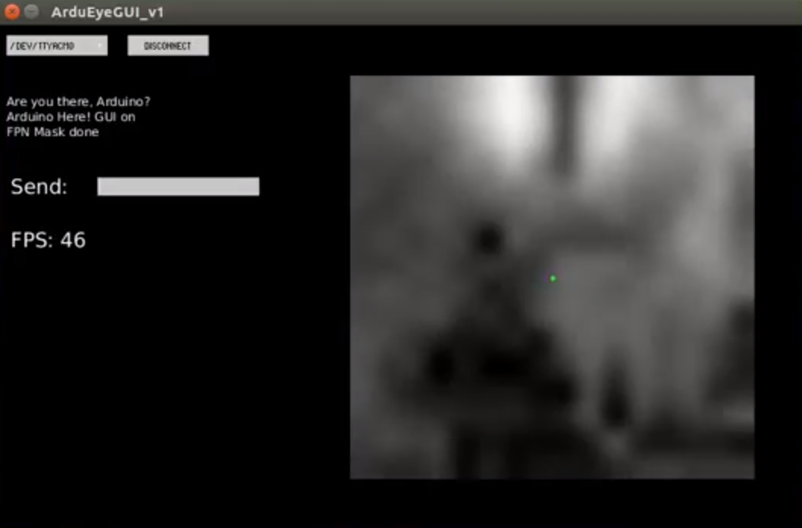

This repository contains Aruduino libraries for using the Stonyman2 vision chip from Centeye, Inc.
Most of this code was adapted from the original [ArduEye repositories](https://github.com/ArduEye) 
to follow current Arduino and C++ practices.

The <b>examples</b> folder contains the following sketches:
<ul>
<li> <b>Tester</b>: simple serial-monitor interaction, providing Matlab-formatted output
<li> <b>GUI</b>: works with the GUI program in <b>extras/processing</b> to display live streaming images
<li> <b>Flow</b>: works with the GUI program in <b>extras/processing</b> to display optical flow
</ul>

The <b>extras</b> folder contains:
<ul>
<li> <b>docs</b>: the most recent public documentation on the Stonyman and Hawksbill chips
<li> <b>processing</b>: a GUI for interacting with the Stonyman2 chip, written in 
<a href="https://processing.org/">Processing</a>
<li> <b>python</b> a Python program <b>snapshot.py</b> that works with the example in <b>examples/Tester</b>
<li> <b>standalone</b> standalone C++ programs (not requiring Stonyman) for optical flow and ASCII imaging
</ul>

To use the optical flow library, first make sure that the [type definition](src/OpticalFlow.h#L37-L39) for pixels (eight-bit or sixteen-bit) agrees
with your image format, commenting-out the appropriate line as needed.  Most image-acquition systems (like OpenCV) use eight-bit grayscale
images, whereas the Stonyman2 chip uses sixteen bits.

