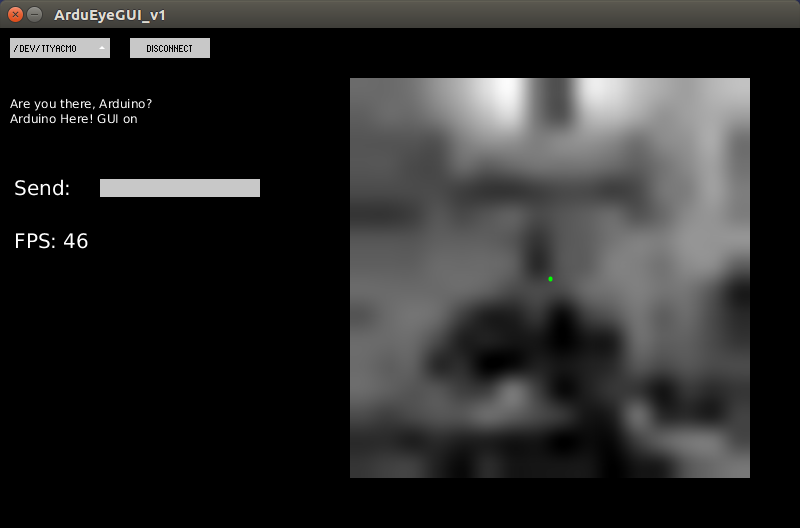

This repository contains fork of the ArduEyeGUI Processing sketch from [Centeye, Inc](http://www.centeye.com/).
This sketch allows you to visualize the output of the Centeye Stonyman2 vision chip connected to an
Arduino or Arduino-compatible microcontroller.  You will also need the 
[ArduEyeLibs](https://github.com/simondlevy/ArduEyeLibs/tree/simondlevy) Arduino libaries.
